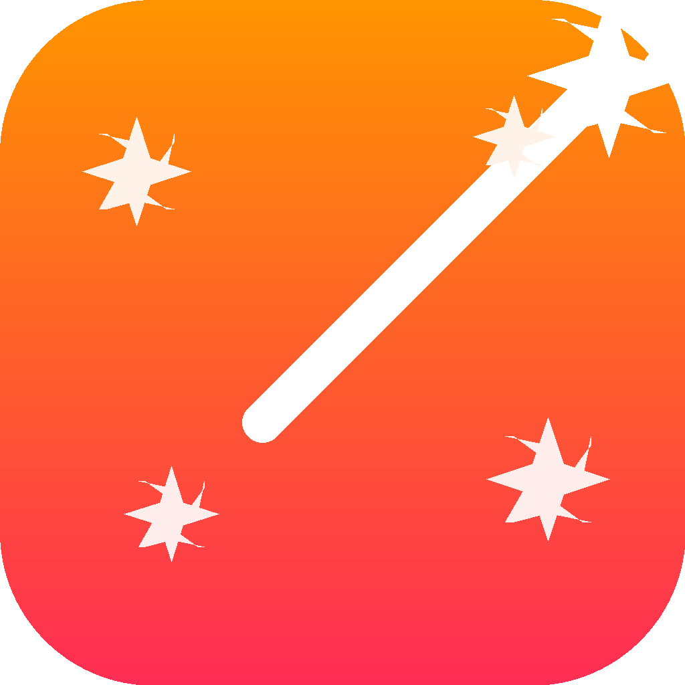

# WishKit

**Make Every Message Magical** ✨

WishKit is an AI-powered iOS app that helps you craft perfect, personalized messages for any occasion. Whether it's a birthday, anniversary, graduation, or just because — WishKit transforms your thoughts into heartfelt, memorable messages in seconds.



## Features

### 🎯 Core Features
- **AI-Powered Message Generation** - Create personalized messages using advanced AI technology
- **Multiple Occasions** - Support for birthdays, anniversaries, graduations, weddings, congratulations, get well, new baby, holidays, and more
- **Customizable Themes** - Choose from movie, musician, TV character, book, show, superhero, comic, or custom themes
- **Relationship-Based** - Tailor messages based on your relationship (friend, family, colleague, partner, mentor, etc.)
- **Message Length Control** - Choose between short, medium, or long messages
- **Emoji Support** - Optional emoji integration for extra personality
- **Custom Notes** - Add personal touches to make messages even more unique

### 📱 User Experience
- **Beautiful Onboarding** - Four-screen guided walkthrough introducing the app's features
- **Animated Splash Screen** - Delightful launch experience with magical sparkle animations
- **Dark Mode Support** - Fully optimized for both light and dark appearance
- **Haptic Feedback** - Tactile responses for better interaction feel
- **Message History** - Save and manage all your generated messages
- **Copy & Share** - Easy sharing to Messages, WhatsApp, email, and more

### 🎨 Design
- **Modern UI** - Clean, gradient-driven design with smooth animations
- **Intuitive Navigation** - Step-by-step wizard-style interface
- **Responsive Cards** - Beautiful selection buttons with visual feedback
- **Premium Animations** - Spring animations, shimmer effects, and smooth transitions

## Screenshots

### Onboarding Flow
1. **Welcome Screen** - Introduces WishKit with emotional messaging
2. **Basics Screen** - Explains key inputs (who, occasion, relationship)
3. **Personalization Screen** - Shows theme customization
4. **Results Screen** - Previews example messages with fun tilted cards

### Main Workflow
1. **Personal Information** - Enter recipient name, occasion, and relationship
2. **Message Theme** - Select theme, length, emoji preference, and add custom notes
3. **Generated Message** - View AI-generated message with copy/share options
4. **History** - Browse and reuse previously generated messages

## Technology Stack

### Frameworks & Tools
- **SwiftUI** - Modern declarative UI framework
- **SwiftData** - Data persistence for message history
- **UserNotifications** - Reminder notifications for important dates
- **Anthropic Claude API** - AI message generation
- **iOS 18.6+** - Latest iOS features and APIs

### Architecture
- **MVVM Pattern** - Clean separation of concerns
- **Environment Objects** - State management with `@Environment` and `@State`
- **Modular Components** - Reusable UI components
- **Navigation Stack** - Modern iOS navigation patterns

### Key Components
```
WishKit/
├── Views/
│   ├── ContentView.swift              # Main app container
│   ├── PersonalInformationView.swift  # Step 1: Basic info
│   ├── MessageThemeView.swift         # Step 2: Theme selection
│   ├── GeneratedMessageView.swift     # Message display
│   ├── MessageHistoryView.swift       # Saved messages
│   └── SettingsView.swift             # App settings
├── Onboarding/
│   ├── OnboardingView.swift           # Coordinator
│   ├── WelcomeScreen.swift            # Screen 1
│   ├── BasicsScreen.swift             # Screen 2
│   ├── PersonalizeScreen.swift        # Screen 3
│   └── ResultsScreen.swift            # Screen 4
├── Components/
│   ├── SelectionButton.swift          # Occasion/theme/relationship cards
│   ├── SelectionGrid.swift            # Grid layout for cards
│   ├── MessageDisplayCard.swift       # Message viewer
│   ├── ThemeSelectionSection.swift    # Theme picker
│   └── [other reusable components]
├── Models/
│   ├── MessageState.swift             # App state management
│   ├── SavedMessage.swift             # SwiftData model
│   ├── Occasion.swift                 # Occasion enum
│   ├── Theme.swift                    # Theme enum
│   └── Relationship.swift             # Relationship enum
├── Managers/
│   ├── OpenAIManager.swift            # AI API integration
│   ├── NotificationManager.swift      # Notification handling
│   └── HapticManager.swift            # Haptic feedback
├── Utilities/
│   ├── AppColors.swift                # Color scheme
│   ├── ViewModifiers.swift            # Custom modifiers
│   └── Extensions.swift               # Helper extensions
└── LaunchScreen.swift                 # Splash screen
```

## Setup Instructions

### Prerequisites
- macOS 14.0 or later
- Xcode 16.0 or later
- iOS 18.6+ deployment target

### Installation

1. **Clone the repository**
   ```bash
   git clone https://github.com/yourusername/wishkit.git
   cd wishkit
   ```

2. **Open in Xcode**
   ```bash
   open WishKit.xcodeproj
   ```

3. **Configure API Key**
   - Open `OpenAIManager.swift`
   - Replace the API key with your Anthropic Claude API key:
     ```swift
     private let apiKey = "YOUR_OPENAI_API_KEY_HERE"
     ```

4. **Update Bundle Identifier** (Optional)
   - Select the project in Xcode
   - Update the Bundle Identifier in the Signing & Capabilities tab

5. **Build and Run**
   - Select a simulator or device
   - Press `Cmd+R` to build and run

### API Key Setup

WishKit uses the OpenAI API for message generation. To get your API key:

1. Visit [Anthropic Console](https://platform.openai.com/)
2. Sign up or log in
3. Navigate to API Keys section
4. Create a new API key
5. Add the key to `OpenAIManager.swift`

## Usage

### First Launch
1. Splash screen displays with magical animation
2. Onboarding walkthrough introduces features
3. Complete onboarding to reach the main app

### Creating a Message
1. **Enter Basic Information**
   - Type recipient's name
   - Select the occasion
   - Choose your relationship

2. **Customize Theme**
   - Pick a theme (or go custom)
   - Specify the theme details
   - Choose message length
   - Toggle emoji inclusion
   - Add optional custom notes

3. **Generate & Review**
   - Tap "Generate Message"
   - AI creates personalized message
   - Review and edit if needed

4. **Share or Save**
   - Copy to clipboard
   - Share via Messages, WhatsApp, email
   - Automatically saved to history

### Managing History
- View all generated messages
- Search and filter
- Copy or reshare previous messages
- Delete unwanted messages

## Customization

### Modifying Colors
Edit `AppColors.swift` to change the app's color scheme:
```swift
static let primaryGradient = LinearGradient(...)
static let accentColor = Color.orange
```

### Adding New Occasions
Add to `Occasion.swift`:
```swift
enum Occasion: String, Codable {
    case birthday
    case anniversary
    // Add your new occasion here
    case myNewOccasion
}
```

### Adding New Themes
Add to `Theme.swift`:
```swift
enum Theme: String, Codable {
    case movie
    case musician
    // Add your new theme here
    case myNewTheme
}
```

## App Icon Generation

The app includes a Python script to regenerate the app icon:

```bash
python3 generate_app_icon.py
```

This creates a magic wand icon with sparkles in all required iOS sizes. The icons are saved in the `AppIcon/` directory and automatically configured in the project.

## Features in Detail

### Dark Mode
WishKit fully supports iOS dark mode with:
- Adjusted color opacities for better visibility
- Enhanced selection states with colored backgrounds
- Proper contrast ratios throughout
- Smooth transitions between modes

### Animations
- **Spring animations** for natural, bouncy feel
- **Shimmer effects** on primary CTA buttons
- **Scale animations** on button presses
- **Fade transitions** between screens
- **Rotation effects** for sparkle icons

### Accessibility
- VoiceOver support
- Dynamic Type support
- Minimum touch target sizes
- Clear visual hierarchy

## Notifications

WishKit can send reminder notifications for important dates:
- Requests permission after first message generation
- Non-intrusive permission flow
- Respects user privacy and preferences

## Privacy

- No user data is collected
- Messages are not stored on external servers
- All data stored locally using SwiftData
- API calls are made directly to Anthropic
- No analytics or tracking

## Troubleshooting

### Build Issues
- Ensure you're using Xcode 16.0+
- Clean build folder: `Cmd+Shift+K`
- Delete derived data if needed

### API Issues
- Verify API key is correctly set
- Check API quota/credits
- Ensure network connectivity
- Review console logs for error details

### Icon Issues
If icons don't generate:
```bash
pip3 install Pillow
python3 generate_app_icon.py
```

## Contributing

This is currently a personal project. If you'd like to contribute:
1. Fork the repository
2. Create a feature branch
3. Make your changes
4. Submit a pull request

## Roadmap

Potential future features:
- [ ] Multiple language support
- [ ] Voice input for custom notes
- [ ] Message templates library
- [ ] Calendar integration for reminders
- [ ] Message scheduling
- [ ] Contact integration
- [ ] iPad optimization
- [ ] macOS version
- [ ] Widget support

## License

[Add your license here]

## Credits

- **Design & Development**: Diayan Siat
- **AI Provider**: Anthropic Claude
- **Icon Design**: Custom generated

## Support

For questions, issues, or suggestions:
- Open an issue on GitHub
- Contact: [your email]

---

**WishKit** - Making every message magical ✨
